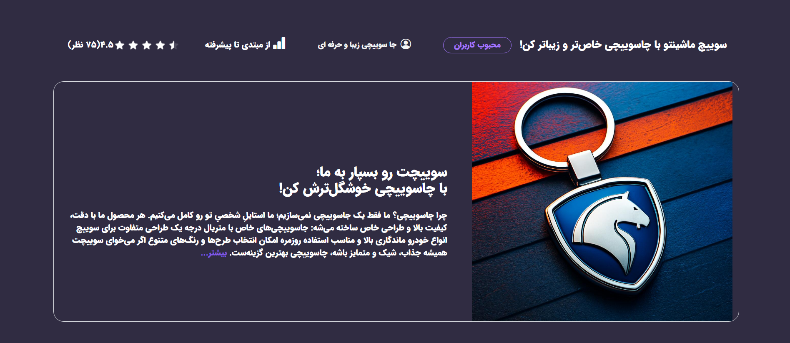

# 🚗 Sina Auto Gallery | سامانه مدیریت قرعه کشی

یک پلتفرم جامع برای مدیریت، خرید و فروش خودرو. این پروژه با تمرکز بر **سرعت**، **امنیت** و **تجربه کاربری (UX)** بالا توسعه یافته است.

> ⚠️ **توجه:** به دلیل محرمانه بودن کدهای اصلی پروژه، این مخزن صرفاً شامل دموها، مستندات فنی و ساختار کلی پروژه است.

---

## ✨ ویژگی‌های کلیدی

### 🏠 برای کاربران
*   **طراحی واکنش‌گرا (Responsive):** کاملاً بهینه برای موبایل، تبلت و دسکتاپ.

### 👨‍💻 برای ادمین‌ها
*   **پنل مدیریت قدرتمند:** مدیریت کامل قرعه کشی، اکسل کاربران شرکت کرده و برنده ها.
*   **مدیریت محتوای پویا:** افزودن و ویرایش سریع اطلاعات سایت.

---

## 🛠️ تکنولوژی‌ها و فریم‌ورک‌ها

این پروژه با استفاده از جدیدترین استانداردهای توسعه وب پایتون ساخته شده است:

| دسته | تکنولوژی‌ها |
| :--- | :--- |
| **Backend** | Python, Django, Django REST Framework (DRF) |
| **Database** | PostgreSQL (برای مدیریت داده‌های حجیم و امن) |
| **Frontend** | HTML5, CSS3, JavaScript, Bootstrap 5, jQuery |
| **Image Processing** | Pillow (بهینه‌سازی تصاویر آپلود شده) |
| **Tools** | Git, Docker (پشتیبانی از داکر)، Nginx |

---

## 📸 دمو و تصاویر پروژه

### 1. صفحه اصلی
در این بخش کاربر می‌تواند قرعه کشی موجود درسایت را ببیند و ثبت نام کند.

---
